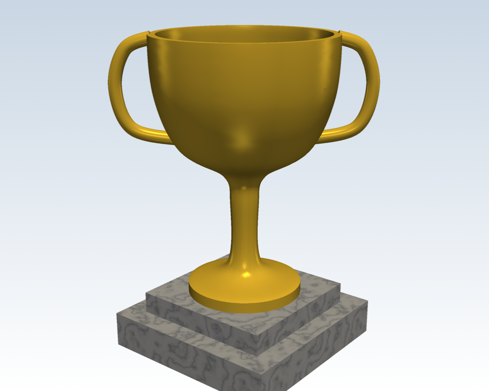

# csgpy

Constructive solid geometry for Python, backed by Rust ([`csgrs`](https://crates.io/crates/csgrs) for shapes, [`manifold-rust`](https://crates.io/crates/manifold-rust) for booleans, via [PyO3](https://pyo3.rs)).

Build 3D solids out of primitives, booleans and transforms; build 2D
profiles out of primitives, arcs and smooth curves, then turn them into
solids by extruding, revolving or sweeping them along a path. Nothing is
computed until you ask for it - `Solid`/`Sketch` are lazy expression trees,
so chains of booleans and transforms are cheap to build and only meshed
once, on demand.

```bash
pip install csgpy[pyvista]   # pyvista is optional, for rendering
```

Python 3.10+ on Windows, macOS and Linux. Reading this on PyPI? The
example images and links work on
[the GitHub README](https://github.com/favm72/csgpy#readme).

## Quick start

```python
from csgpy import box, cylinder
from csgpy.pyvista import show

plate = box(60, 40, 8) - cylinder(10, 20).translate(30, 20, -5)
show(plate, color="steelblue")
plate.save_stl("plate.stl")   # ready for a slicer
```

## Examples

### A gold trophy - [`examples/trophy.py`](examples/trophy.py)

A profile drawn with `path` and `.revolve()`d into the cup, handles
`.sweep()`d along a curve, and a marble plinth from a PNG texture:

```python
cup = (
    path(0, 0).line(8, 0).line(8, 1.5)                                    # foot
    .soft(2.5, 4).soft(2, 13).soft(3, 17).soft(9, 21).soft(12, 28).soft(12.5, 36)  # outside
    .line(11.5, 36).soft(10.5, 28).soft(0, 23)                            # inside
    .close().build().revolve(360, segments=64).rotate(90, 0, 0)
)
ear = path(8.5, 22).soft(15, 23.5).soft(17, 29).soft(15.5, 34).soft(12, 35.5).points()
handle = circle(0.9, segments=16).sweep([(x, 0, z) for x, z in ear])
plinth = box(26, 26, 5).translate(-13, -13, -8) + box(20, 20, 3).translate(-10, -10, -3)

scene = Scene()
scene.add(cup, "gold")
scene.add(handle + handle.rotate(0, 0, 180), "gold")
scene.add(plinth, texture="textures/marble.png", texture_scale=20)
scene.show()
```



### A castle tower - [`examples/castle.py`](examples/castle.py)

Booleans in a loop carve the battlements and arrow slits; bricks and wood
planks come from PNG files:

```python
tower = cylinder(10, 40, segments=64) - cylinder(8, 20, segments=64).translate(0, 0, 32)
for i in range(8):
    tower = tower - box(4, 12, 6).translate(-2, 0, 36).rotate(0, 0, i * 45 + 22.5)

scene = Scene()
scene.add(tower, texture="textures/bricks.png", mapping="cylinder", texture_scale=14)
scene.add(ground, texture="textures/wood.png", texture_scale=22)
scene.add(roof, "royalblue")
scene.show()
```


### A handful of dice - [`examples/dice.py`](examples/dice.py)

Cube-minus-sphere, many times over: each die is a cube rounded off by a
sphere with 21 spherical pips subtracted, and the one die is reused for
all five (computed once, not five times). The whole scene evaluates in
well under a second:

```python
body = cube & sphere(14.2, segments=96, stacks=48)
for value, place in FACES.items():
    for u, v in LAYOUTS[value]:
        body = body - sphere(2.2, segments=32, stacks=16).translate(*place(u, v, 10.8))

for (x, y, z), (rx, ry, rz), color in placements:
    scene.add(body.rotate(rx, ry, rz).translate(x, y, z), color)
```


### Advanced: a lighthouse island - [`examples/advanced/lighthouse.py`](examples/advanced/lighthouse.py)

A lighthouse island with a sailboat: nearly every primitive and operation
in one scene, with textures generated in numpy instead of loaded from
files.


## Primitives

| | |
|---|---|
| `box(width, length, height)` | axis-aligned cuboid, corner at the origin |
| `cylinder(radius, height, segments=32)` | standing on the XY plane |
| `sphere(radius, segments=32, stacks=16)` | centered at the origin |
| `cone(radius, height, segments=32)` | standing on the XY plane, apex up |
| `circle(radius, segments=32)` | 2D, centered at the origin |
| `square(width)` / `rectangle(width, length)` | 2D, corner at the origin |
| `polygon(points)` | 2D, from an ordered `[(x, y), ...]` list |
| `bezier(control, segments=32)` | 2D Bezier curve through `control`'s ends |
| `bspline(control, degree=3, segments_per_span=8)` | 2D, tangent-continuous, local control |

The first four return a `Solid`; the rest return a `Sketch` (see below).
`bezier`/`bspline` are closed (fillable) exactly when their first and last
control points coincide - otherwise they're open curves, useful as a
`sweep()` path but not as an `extrude()`/`revolve()` base.

## `Sketch`: 2D profiles

Transform: `.translate(dx, dy)` `.rotate(deg)` `.scale(sx, sy=None)`

Boolean: `.union(other)` / `+` `.subtract(other)` / `-` `.intersect(other)` / `&`

Turn into a `Solid`:
- `.extrude(height)` - straight up the Z axis
- `.extrude_vector(dx, dy, dz)` - along any direction (a slanted/sheared extrude)
- `.revolve(angle_degs=360, segments=32)` - spun around the Y axis (a lathe)
- `.sweep(path)` - duplicated along a 3D point list, aimed at the local tangent, side walls stitched between copies (extrude-along-a-path)

## `Solid`: 3D solids

Transform: `.translate(dx, dy, dz)` `.rotate(rx=0, ry=0, rz=0)` `.scale(sx, sy=None, sz=None)`

Boolean: `.union(other)` / `+` `.subtract(other)` / `-` `.intersect(other)` / `&`

Evaluate: `.to_mesh()` -> `(vertices, triangles)`, cached after the first
call.

Booleans run on a port of [Manifold](https://github.com/elalish/manifold),
so finely tessellated input (`sphere(10, 512, 256) - box(...)`) takes
seconds, not all your RAM. Both operands should be closed solids; if one
isn't, a small boolean still works through csgrs's own algorithm and a
large one raises `RuntimeError`.

As a last line of defense, while a solid is being evaluated the process
may use at most half the machine's RAM - past that it's ended, rather than
freezing the computer. Change it with `csgpy.set_memory_limit(megabytes)`
(`None` for no cap) or the `CSGPY_MEMORY_LIMIT_MB` environment variable
(`0` for no cap). Enforced on Windows and Linux.

## Exporting

```python
part.save_stl("part.stl")               # binary STL - for 3D printing / slicers / CAD
part.save_stl("part.stl", ascii=True)   # text STL, if a tool needs it
part.save_obj("part.obj")               # OBJ - Blender, game engines, web viewers
```

Paths can be strings or `pathlib.Path`s. Other formats (PLY, glTF, VTK,
...) are one line away through the renderer:
`csgpy.pyvista.mesh(part).save("part.ply")`.

## `csgpy.path`: a fluent profile builder

`polygon()`/`bezier()`/`bspline()` cover a lot, but a profile mixing
straight edges, arcs around different centers, and smooth tangent-continuous
curves needs `csgpy.path` instead - it tessellates all of that down to a
point list for you and hands it to `polygon()`:

```python
from csgpy.path import path

rounded_square = (
    path(4, 0).line(16, 0).arc(20, 4, center=(16, 4))
    .line(20, 16).arc(16, 20, center=(16, 16))
    .line(4, 20).arc(0, 16, center=(4, 16))
    .line(0, 4).arc(4, 0, center=(4, 4))
    .close()
    .build()
)
```

- `.line(x, y)` / `.next(dx, dy)` - straight line, absolute or relative
- `.arc(x, y, center=(cx, cy), ccw=True)` - arc to a point around a center
- `.soft(x, y)` / `.tangent(x, y)` - curves *through* the point, tangent-continuous with its neighbors (unlike `bezier`/`bspline`, which only pass through their first/last control point)
- `.angled(turn_deg, distance)` - turtle-style: turn, then move forward
- `.close(smooth=False)` - closes the loop; `smooth=True` makes the closing seam a `.soft(..)` curve too
- `.points()` - the tessellated `[(x, y), ...]` list, if you want it raw
- `.build()` - `polygon(self.points())`, ready to extrude/revolve/sweep

## Rendering

`csgpy` itself has no rendering code or dependency - `Solid.to_mesh()` is
plain data. `csgpy.pyvista` (the `pyvista` extra) is one render backend
built on top of it:

```python
from csgpy.pyvista import Scene, show

show(part, color="steelblue")          # one solid, one window

scene = Scene(background=("white", "lightsteelblue"), size=(1200, 900))
scene.add(walls, texture="bricks.png", texture_scale=8)
scene.add(roof, "firebrick")
scene.add(glass, "skyblue", opacity=0.5)
scene.show(camera="iso", screenshot="house.png")
```

- `Scene(background=..., size=..., off_screen=False)` - `background` is a
  color or a `(bottom, top)` gradient; `off_screen=True` renders without a
  window (for saving screenshots from scripts).
- `scene.add(solid, color, texture=None, mapping="box", texture_scale=10, smooth=True, edges=False, **kwargs)` -
  returns the scene, so calls can chain. Curved surfaces are smooth-shaded
  with sharp edges kept sharp; `smooth=False` gives a faceted look. Extra
  keywords (`opacity`, `specular`, `ambient`, ...) go to PyVista's `add_mesh`.
- `scene.show(camera="iso", screenshot=None)` - `camera` is a preset
  (`"iso"`, `"xy"`, ...) or `[eye, focus, up]`.
- `scene.plotter` is the underlying `pyvista.Plotter`, for anything else.

### Textures

Pass `texture=` instead of a color - an image file path (`.png`, `.jpg`),
a `(height, width, 3)` uint8 numpy array, or a `pyvista.Texture`. Textures
repeat: `texture_scale` is how many world units one tile covers, and
`mapping` picks how the image is projected onto the solid:

| `mapping` | good for |
|---|---|
| `"box"` (default) | anything boxy - each face gets the image straight on |
| `"cylinder"` | towers, columns, bottles - wraps round the Z axis |
| `"sphere"` | balls and domes - wraps round Z, pole to pole |

`mesh(solid)`, `texture_coordinates(poly, mapping, scale)` and
`smooth_normals(poly)` are the building blocks, if you'd rather drive
PyVista yourself.

## Building from source

```bash
uv sync                       # builds the extension (release) into .venv
maturin develop --release     # rebuild after editing Rust code
python tests/smoke_test.py
```

Use `--release` with `maturin develop`: a debug build of our own crate is
noticeably slower on big models (the geometry dependencies are optimized
either way, see `[profile.dev.package."*"]` in `Cargo.toml`).
